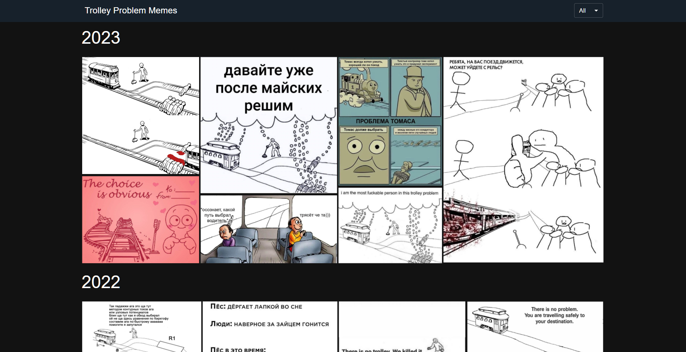
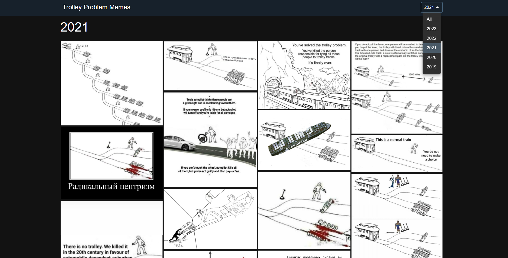
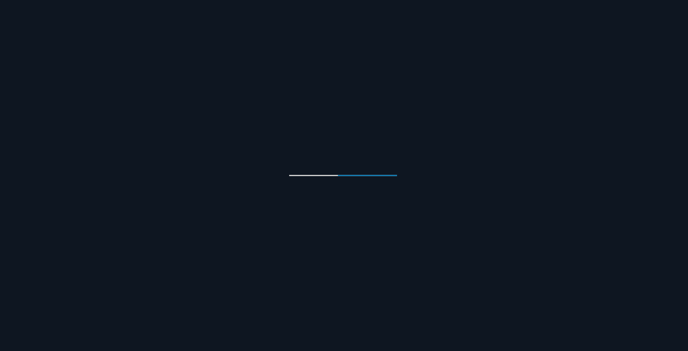
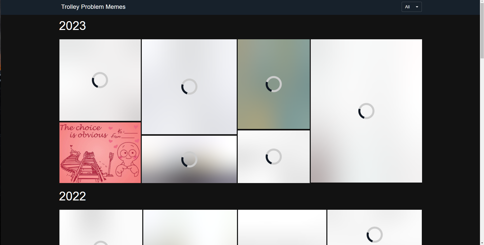
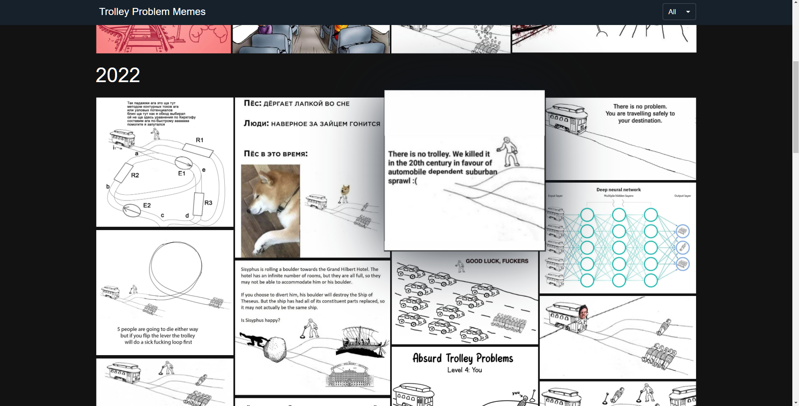
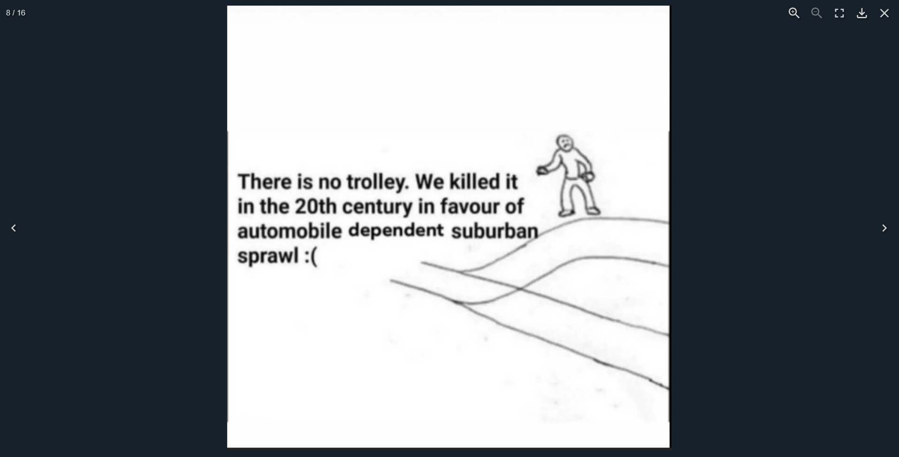
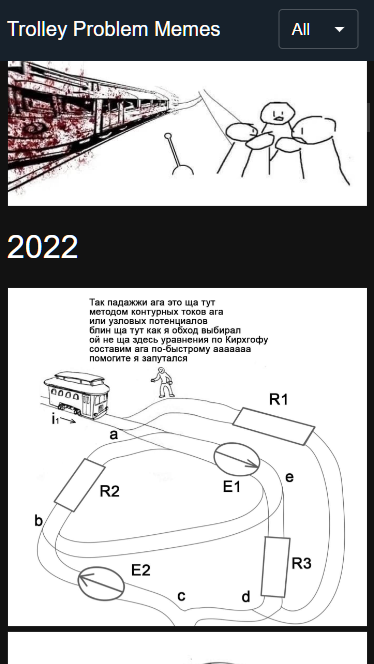
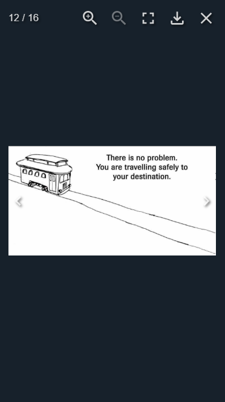

<h1 align="center">Trolley Problem Memes</h1>
<p align="center">
  Made with <code>HTML</code>, <code>CSS</code>, <code>TypeScript</code>, <code>ReactJS</code>, <code>CSS Modules</code>
  <br>
  Bootstrapped with <code>Vite</code>
</p>

<p align="center">
  <a href="../../actions"></a>
  <a href="../../commits"></a>
  <a href="./LICENSE"></a>
  
  
</p>

<p align="center">
  <a href="#-screenshots">🖼 Screenshots</a> • 
  <a href="#ℹ%EF%B8%8F-about">ℹ️ About</a> • 
  <a href="#%EF%B8%8F-tools">⚙️ Tools</a> • 
  <a href="#-build-project">🔨 How to Build Project</a> • 
  <a href="#-file-structure">📁 File Structure</a>
</p>

<sup>
  <p align="center">
    <a href="#-npm-packages-worth-mentioning">📦 NPM Packages worth mentioning</a> • 
    <a href="#-details">💡 Details</a> • 
    <a href="#-useful-resources">🔗 Useful resources</a> • 
    <a href="#-author">👤 Author</a>
  </p>
</sup>

## 🖼 Screenshots

<p align="center">
  
</p>

<p align="center">
  
</p>

<p align="center">
  
</p>

<p align="center">
  
</p>

<p align="center">
  
</p>

<p align="center">
  
</p>

<p align="center">
  
  
</p>

## ℹ️ About

Well, I love trolley problem memes, so why not create a site dedicated to that?

I didn't make any Figma prototypes this time.

## ⚙️ Tools

- **HTML5**
  - ReactJS
- **CSS**
  - CSS Modules
- **TypeScript**
  - ReactJS
- **Github Pages**

## 🔨 Build project

<table>
  <tr>
    <th>Command</th>
    <th>Description</th>
  </tr>
  <tr>
    <td><code>npm&nbsp;install</code></td>
    <td>First of all install all required packages</td>
  </tr>
  <tr>
    <td><code>npm&nbsp;run&nbsp;dev</code></td>
    <td>Run the app in development mode</td>
  </tr>
  <tr>
    <td><code>npm&nbsp;run&nbsp;build</code></td>
    <td>Build the app</td>
  </tr>
  <tr>
    <td><code>npm&nbsp;run&nbsp;preview</code></td>
    <td>Run the app in production mode</td>
  </tr>
  <tr>
    <td><code>npm&nbsp;run&nbsp;lint</code></td>
    <td>Check compliance with Eslint rules</td>
  </tr>
</table>

## 📁 File Structure

```Markdown
├── 📁 .github
|   ├── 📁 workflows
|   |   └── 📝 main.yaml      CI/CD instructions for Github Actions
│   └── 📝 dependabot.yml     Instructions for Dependabot
|
├── 📁 docs                   Additional information, documentation
│   └── 📁 results            Screenshots of how the application works after being fully developed
|
├── 📁 src                    Source files needed for application development
│   ├── 📁 assets             Static assets: images, icons, favicons
|   |   ├── 📁 gallery        Images displayed on the page
|   |   ├── 📝 favicon.png    Favicon
|   |   └── 📝 preview.webp   Previw for og:image, doesn't work tho because of Vite
|   |
│   ├── 📁 components         React components
|   |   └── 📁 ComponentName
|   |       ├── 📝 index.tsx          Component logic
|   |       ├── 📝 index.module.css   Component styles
|   |       └── 📝 index.types.tsx    Component types (optional)
|   |
│   ├── 📁 hooks              Custom React hooks
|   |
│   ├── 📝 App.tsx            App React component
│   ├── 📝 App.module.scss    App styles (optional)
│   ├── 📝 index.css          Global styles
│   ├── 📝 loader-spinner.css Styles for spinner displayed before scripts are fully loaded
│   ├── 📝 index.tsx          Entry point for the module bundler
│   ├── 📝 index.html         Main html file
│   └── 📝 vite-end.d.ts      Some Typescript stuff for Vite
|
├── 📝 .eslintrc.cjs          ESLint configuration file
├── 📝 .gitignore             Instructions for Git about what files to ignore
├── 📝 LICENSE                MIT License. Basically you can do whatever you want with the code
├── 📝 README.md              Project description
├── 📝 package-lock.json      Keeps track of the exact version of every package that is installed
├── 📝 package.json           Various metadata relevant to the project, scripts, dependencies
├── 📝 tsconfig.json          TypeScript configuration file
├── 📝 tsconfig.node.json     TypeScript configuration file for Vite
└── 📝 vite.config.js         Vite configuration file
```

## 📦 NPM Packages worth mentioning

<table>
  <tr>
    <td><code>clsx</code></td>
    <td>For conditional lists of CSS classes</td>
  </tr>
  <tr>
    <td><code>mui packages</code></td>
    <td>Popular component library</td>
  </tr>
  <tr>
    <td><code>blurhash, react-blurhash</code></td>
    <td>For generating a blurred version of a string using a hash string</td>
  </tr>
  <tr>
    <td><code>react-photo-album</code></td>
    <td>For beautiful rendering of photos in rows and columns</td>
  </tr>
  <tr>
    <td><code>yet-another-react-lightbox</code></td>
    <td>For opening images in full-screen mode + some addons for manipulations with images</td>
  </tr>
</table>

## 💡 Details

I learnt how to show blurred versions of images with spinners before they load and then animate transitions to the loaded images. Blurhash and some guides on YouTube help me to understand how it works.

Also this project gave me some more experience in working with external libraries. For example, I used `react-photo-album` and had to write a custom image renderer in order to implement the logic described in the paragraph above. The documentation about how to do this was scarce, I had to invent ways how to do it, ended up by console logging props and extracting the needed ones from there.

It required some time to figure out how to break `react-photo-album` in several albums: one for each year so that `yet-another-react-lightbox` doesn't break. Finally, I found ways how to do it.

I got some practice with image optimization. Mainly, I just optimized the images using tinypng web-service.

Some more Material UI was used in that project.

The site is also responsive, as usual.

## 🔗 Useful resources

- `react-photo-album` docs - https://react-photo-album.com/
- `yet-another-react-lightbox` docs - https://yet-another-react-lightbox.com/
- How to use Blurhash with images - https://www.youtube.com/watch?v=VyUJUD5gyoo
- Optimize images TinyPNG - https://tinypng.com/

## 👤 Author

- Frontend Mentor - [@GrbnvAlex](https://www.frontendmentor.io/profile/GrbnvAlex)
- Telegram - [@Arlagonix](https://t.me/Arlagonix)
- Github - [@arlagonix](https://github.com/arlagonix)
